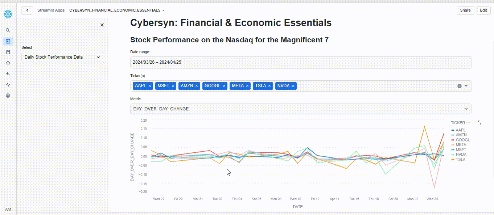

<br>

 &nbsp;  &nbsp;  &nbsp;  &nbsp; 

---

<div style="padding: 10px; background-color: yellow">

# Real Time Stock Analysis

</div>

<br>

# 1. Overview

This guide provides the instructions for building a Streamlit application using Snowpark for Python and <strong><span style="color: blue;">[Cybersyn data](https://app.cybersyn.com/data_catalog/)</span></strong> from the Snowflake Marketplace.

## What we will build

A Streamlit application that loads and visualizes daily <strong>stock performance</strong> and <strong>foreign exchange (FX) rate</strong> data loaded from <strong><span style="color: blue;">[Cybersyn](https://app.snowflake.com/marketplace/listing/GZTSZAS2KF7/cybersyn-financial-economic-essentials)</span></strong> on the Snowflake Marketplace using Snowpark for Python.



<br>

### What is Snowspark?

The set of libraries and runtime in Snowflake that securely deploy and process non-SQL code, including Python, Java and Scala.

<strong>Familiar Client Side Libraries</strong> - Snowflake brings deeply integrated, Data-Frame style programming and OSS compatible APIs to the language data practitioners like to use. It also includes the Snowpark ML API for more efficient ML modelling (public preview) and ML operations (private preview).

<strong>Flexible Runtime Constructs</strong> - Snowpark provides flexible runtime constructs that allow users to bring in and run custom logic. Developers can seamlessly build data pipelines, ML models, and data applications with User-Defined Functions and Stored Procedures.

Learn more about <strong><span style="color: blue;">[Snowpark](https://snowflake.com/en/data-cloud/snowpark/)</span></strong>

<br>

<p align="center">
  
</p>

<br>

### What is Streamlit?

Streamlit enables data scientists and Python developers to combine Streamlit's component-rich, open-source Python library with the scale, performance, and security of the Snowflake platform.


### What is Cybersyn?

<strong><span style="color: blue;">[Cybersyn](https://app.cybersyn.com/data_catalog/)</span></strong> is a data-as-a-service-company creating a real-time view of the world's economy with analytics-ready economic data on Snowflake Marketplace. Cybersyn builds derived data products from datasets that are difficult to procure, clean, or join. With Cybersyn, you can access external data directly in your Snowflake instance - no ETL requred.

### Prerequisites

1. A <strong><span style="color: blue;">[Snowflake](https://www.snowflake.com/en/)</span></strong> account in <strong>AWS US Oregon</strong>

2. Access to the <strong>Financial & Economic Essentials</strong> dataset provided by <strong>Cybersyn</strong>.

       
&nbsp;&nbsp;&nbsp;&nbsp;&nbsp;&nbsp;&nbsp;&nbsp;&nbsp;&nbsp;&nbsp;&nbsp;&nbsp;&nbsp;&nbsp;&nbsp;&nbsp;In the <strong><span style="color: blue;">[ Snowflake Marketplace](https://app.snowflake.com/marketplace/listing/GZTSZAS2KF7/cybersyn-financial-economic-essentials)</span></strong>, click on <strong>Get Data</strong> and follow the instructions to gain access. <br>
&nbsp;&nbsp;&nbsp;&nbsp;&nbsp;&nbsp;&nbsp;&nbsp;&nbsp;&nbsp;&nbsp;&nbsp;&nbsp;&nbsp;&nbsp;&nbsp;&nbsp;In particular, we will use data in schema <strong>CYBERSYN</strong> from tables <strong><span style="background-color: yellow">STOCK_PRICE_TIMESERIES</span></strong> and <strong>FX_RATES_TIMESERIES</strong>.

<br>

We can have a look at the data description from the link above, but here is a sample view of <strong><span style="background-color: yellow">STOCK_PRICE_TIMESERIES</span></strong> (65.6 million rows) :

<p align="center">
  
</p>

<br>

And here is the sample view of <strong><span style="background-color: yellow">FX_RATES_TIMESERIES</span></strong> (1.0 million rows) :

<p align="center">
  
</p>

<br>

# 2. Get Started

Follow these steps to start building Streamlit application in Snowsight.

<strong>Step 1.</strong> Click on <strong>Streamlit</strong> on the left navigation menu

<strong>Step 2.</strong> Click on <strong>+ Streamlit App</strong> on the top right

<strong>Step 3.</strong> Enter <strong>App name</strong>

<strong>Step 4.</strong> Select <strong>Warehouse</strong> (X-Small) and <strong>App location</strong> (Database and Schema) where you'd like to create the Streamlit applicaton

<strong>Step 5.</strong> Click on <strong>Create</strong>

&nbsp;&nbsp;&nbsp;&nbsp;&nbsp;&nbsp;&nbsp;&nbsp;At this point, we will be provided code for an example Streamlit application

<strong>Step 6.</strong> Replace sample application code displayed in the code editor on the left by following instructions in the subsequent steps

<br>

# 3. Application Setup

Delete existing sample application code in the code editor on the left and add the following code snippet at the very top.


```python
# Import libraries in red
from snowflake.snowpark.context import get_active_session
from snowflake.snowpark.functions import sum, col, when, max, lag
from snowflake.snowpark import Window
from datetime import timedelta
import altair as alt
import streamlit as st
import pandas as pd

# Set page config in red
st.set_page_config(layout="wide")

# Get current session in red
session = get_active_session()
```

In the above code snippet, we're importing the required libraries, setting the application's page config to use full width of the browser window, and gaining access to the current session.

<br>

# 4. Load and Transform Data

Now add the following Python function that loads and caches data from the <code>FINANCIAL__ECONOMIC_ESSENTIALS.CYBERSYN.STOCK_PRICE_TIMESERIES</code> and 
<code>FINANCIAL__ECONOMIC_ESSENTIALS.CYBERSYN.FX_RATES_TIMESERIES</code> tables.

```python
@st.cache_data()
def load_data():
    # Load and transform daily stock price data.
    snow_df_stocks = (
        session.table("FINANCIAL__ECONOMIC_ESSENTIALS.CYBERSYN.STOCK_PRICE_TIMESERIES")
        .filter(
            (col('TICKER').isin('AAPL', 'MSFT', 'AMZN', 'GOOGL', 'META', 'TSLA', 'NVDA')) & 
            (col('VARIABLE_NAME').isin('Nasdaq Volume', 'Post-Market Close')))
        .groupBy("TICKER", "DATE")
        .agg(
            max(when(col("VARIABLE_NAME") == "Nasdaq Volume", col("VALUE"))).alias("NASDAQ_VOLUME"),
            max(when(col("VARIABLE_NAME") == "Post-Market Close", col("VALUE"))).alias("POSTMARKET_CLOSE")
        )
    )
    
    # Adding the Day over Day Post-market Close Change calculation
    window_spec = Window.partitionBy("TICKER").orderBy("DATE")
    snow_df_stocks_transformed = snow_df_stocks.withColumn("DAY_OVER_DAY_CHANGE", 
        (col("POSTMARKET_CLOSE") - lag(col("POSTMARKET_CLOSE"), 1).over(window_spec)) /
        lag(col("POSTMARKET_CLOSE"), 1).over(window_spec)
    )

    # Load foreign exchange (FX) rates data.
    snow_df_fx = session.table("FINANCIAL__ECONOMIC_ESSENTIALS.CYBERSYN.FX_RATES_TIMESERIES").filter(
        (col('BASE_CURRENCY_ID') == 'EUR') & (col('DATE') >= '2019-01-01')).with_column_renamed('VARIABLE_NAME','EXCHANGE_RATE')
    
    return snow_df_stocks_transformed.to_pandas(), snow_df_fx.to_pandas()

# Load and cache data
df_stocks, df_fx = load_data()
```

In the above code snippet, we're leveraging several Snowpark DataFrame functions to load and transform data. For example, <code>filter()</code>, <code>group_by()</code>, <code>agg()</code>, <code>sum()</code>, <code>alias()</code> and <code>isin()</code>.

<br>

# 5. Daily Stock Performance on the Nasdaq by Company

Now add the following Python function that displays daily stock performance. Create selection dropdowns for date, stock ticker, and metric to be visualized.

```python
def stock_prices():
    st.subheader('Stock Performance on the Nasdaq for the Magnificent 7')
    
    df_stocks['DATE'] = pd.to_datetime(df_stocks['DATE'])
    max_date = df_stocks['DATE'].max()  # Most recent date
    min_date = df_stocks['DATE'].min()  # Earliest date
    
    # Default start date as 30 days before the most recent date
    default_start_date = max_date - timedelta(days=30)

    # Use the adjusted default start date in the 'date_input' widget
    start_date, end_date = st.date_input("Date range:", [default_start_date, max_date], min_value=min_date, max_value=max_date, key='date_range')
    start_date_ts = pd.to_datetime(start_date)
    end_date_ts = pd.to_datetime(end_date)

    # Filter DataFrame based on the selected date range
    df_filtered = df_stocks[(df_stocks['DATE'] >= start_date_ts) & (df_stocks['DATE'] <= end_date_ts)]
    
    # Ticker filter with multi-selection and default values
    unique_tickers = df_filtered['TICKER'].unique().tolist()
    default_tickers = [ticker for ticker in ['AAPL', 'MSFT', 'AMZN', 'GOOGL', 'META', 'TSLA', 'NVDA'] if ticker in unique_tickers]
    selected_tickers = st.multiselect('Ticker(s):', unique_tickers, default=default_tickers)
    df_filtered = df_filtered[df_filtered['TICKER'].isin(selected_tickers)]
    
    # Metric selection
    metric = st.selectbox('Metric:',('DAY_OVER_DAY_CHANGE','POSTMARKET_CLOSE','NASDAQ_VOLUME'), index=0) # Default to DAY_OVER_DAY_CHANGE
    
    # Generate and display line chart for selected ticker(s) and metric
    line_chart = alt.Chart(df_filtered).mark_line().encode(
        x='DATE',
        y=alt.Y(metric, title=metric),
        color='TICKER',
        tooltip=['TICKER','DATE',metric]
    ).interactive()
    st.altair_chart(line_chart, use_container_width=True)
```

In the above code snippet, a line chart is constructed which takes a dataframe as one of the parameters. In our case, that is a subset of the <code>df_stocks</code> dataframe filtered by ticker, date, and metric using Streamlit's built in components. This enhances the customizability of the visualization.

<br>

# 6. EUR Exchange (FX) Rates by Quote Currency

Next, add the following Python function that displays a currency selection dropdown and a chart to visualize euro exchange rates over time for the selected quote currencies.

```python
def fx_rates():
    st.subheader('EUR Exchange (FX) Rates by Currency Over Time')

    # GBP, CAD, USD, JPY, PLN, TRY, CHF
    currencies = ['British Pound Sterling','Canadian Dollar','United States Dollar','Japanese Yen','Polish Zloty','Turkish Lira','Swiss Franc']
    selected_currencies = st.multiselect('', currencies, default = ['British Pound Sterling','Canadian Dollar','United States Dollar','Swiss Franc','Polish Zloty'])
    st.markdown("___")

    # Display an interactive chart to visualize exchange rates over time by the selected currencies
    with st.container():
        currencies_list = currencies if len(selected_currencies) == 0 else selected_currencies
        df_fx_filtered = df_fx[df_fx['QUOTE_CURRENCY_NAME'].isin(currencies_list)]
        line_chart = alt.Chart(df_fx_filtered).mark_line(
            color="lightblue",
            line=True,
        ).encode(
            x='DATE',
            y='VALUE',
            color='QUOTE_CURRENCY_NAME',
            tooltip=['QUOTE_CURRENCY_NAME','DATE','VALUE']
        )
        st.altair_chart(line_chart, use_container_width=True)
```

In the above code snippet, a line chart is constructed which takes a dataframe as one of the parameters. In our case, that is a subset of the <code>df_fx</code> dataframe filtered by the currencies selected via Streamlit's <code>multiselect()</code> user input component.

<br>

# 7. Application Components

Add the following code snippet to display application header, create a sidebar, and map <code>stock_prices()</code> and <code>fx_rates()</code> functions to Daily Stock Performance Data and Exchange (FX) Rates options respectively in the sidebar.

```python
# Display header
st.header("Cybersyn: Financial & Economic Essentials")

# Create sidebar and load the first page
page_names_to_funcs = {
    "Daily Stock Performance Data": stock_prices,
    "Exchange (FX) Rates": fx_rates
}
selected_page = st.sidebar.selectbox("Select", page_names_to_funcs.keys())
page_names_to_funcs[selected_page]()
```

<br>

# 8. Run Application

The fun part! Assuming your code is free of syntax and other errors, you're ready to run the Streamlit application.

### Code
Here's what the entire application code should look like.

```python
# Import libraries
from snowflake.snowpark.context import get_active_session
from snowflake.snowpark.functions import sum, col, when, max, lag
from snowflake.snowpark import Window
from datetime import timedelta
import altair as alt
import streamlit as st
import pandas as pd

# Set page config
st.set_page_config(layout="wide")

# Get current session
session = get_active_session()

@st.cache_data()
def load_data():
    # Load and transform daily stock price data.
    snow_df_stocks = (
        session.table("FINANCIAL__ECONOMIC_ESSENTIALS.CYBERSYN.STOCK_PRICE_TIMESERIES")
        .filter(
            (col('TICKER').isin('AAPL', 'MSFT', 'AMZN', 'GOOGL', 'META', 'TSLA', 'NVDA')) & 
            (col('VARIABLE_NAME').isin('Nasdaq Volume', 'Post-Market Close')))
        .groupBy("TICKER", "DATE")
        .agg(
            max(when(col("VARIABLE_NAME") == "Nasdaq Volume", col("VALUE"))).alias("NASDAQ_VOLUME"),
            max(when(col("VARIABLE_NAME") == "Post-Market Close", col("VALUE"))).alias("POSTMARKET_CLOSE")
        )
    )
    
    # Adding the Day over Day Post-market Close Change calculation
    window_spec = Window.partitionBy("TICKER").orderBy("DATE")
    snow_df_stocks_transformed = snow_df_stocks.withColumn("DAY_OVER_DAY_CHANGE", 
        (col("POSTMARKET_CLOSE") - lag(col("POSTMARKET_CLOSE"), 1).over(window_spec)) /
        lag(col("POSTMARKET_CLOSE"), 1).over(window_spec)
    )

    # Load foreign exchange (FX) rates data.
    snow_df_fx = session.table("FINANCIAL__ECONOMIC_ESSENTIALS.CYBERSYN.FX_RATES_TIMESERIES").filter(
        (col('BASE_CURRENCY_ID') == 'EUR') & (col('DATE') >= '2019-01-01')).with_column_renamed('VARIABLE_NAME','EXCHANGE_RATE')
    
    return snow_df_stocks_transformed.to_pandas(), snow_df_fx.to_pandas()

# Load and cache data
df_stocks, df_fx = load_data()

def stock_prices():
    st.subheader('Stock Performance on the Nasdaq for the Magnificent 7')
    
    df_stocks['DATE'] = pd.to_datetime(df_stocks['DATE'])
    max_date = df_stocks['DATE'].max()  # Most recent date
    min_date = df_stocks['DATE'].min()  # Earliest date
    
    # Default start date as 30 days before the most recent date
    default_start_date = max_date - timedelta(days=30)

    # Use the adjusted default start date in the 'date_input' widget
    start_date, end_date = st.date_input("Date range:", [default_start_date, max_date], min_value=min_date, max_value=max_date, key='date_range')
    start_date_ts = pd.to_datetime(start_date)
    end_date_ts = pd.to_datetime(end_date)

    # Filter DataFrame based on the selected date range
    df_filtered = df_stocks[(df_stocks['DATE'] >= start_date_ts) & (df_stocks['DATE'] <= end_date_ts)]
    
    # Ticker filter with multi-selection and default values
    unique_tickers = df_filtered['TICKER'].unique().tolist()
    default_tickers = [ticker for ticker in ['AAPL', 'MSFT', 'AMZN', 'GOOGL', 'META', 'TSLA', 'NVDA'] if ticker in unique_tickers]
    selected_tickers = st.multiselect('Ticker(s):', unique_tickers, default=default_tickers)
    df_filtered = df_filtered[df_filtered['TICKER'].isin(selected_tickers)]
    
    # Metric selection
    metric = st.selectbox('Metric:',('DAY_OVER_DAY_CHANGE','POSTMARKET_CLOSE','NASDAQ_VOLUME'), index=0) # Default to DAY_OVER_DAY_CHANGE
    
    # Generate and display line chart for selected ticker(s) and metric
    line_chart = alt.Chart(df_filtered).mark_line().encode(
        x='DATE',
        y=alt.Y(metric, title=metric),
        color='TICKER',
        tooltip=['TICKER','DATE',metric]
    ).interactive()
    st.altair_chart(line_chart, use_container_width=True)

def fx_rates():
    st.subheader('EUR Exchange (FX) Rates by Currency Over Time')

    # GBP, CAD, USD, JPY, PLN, TRY, CHF
    currencies = ['British Pound Sterling','Canadian Dollar','United States Dollar','Japanese Yen','Polish Zloty','Turkish Lira','Swiss Franc']
    selected_currencies = st.multiselect('', currencies, default = ['British Pound Sterling','Canadian Dollar','United States Dollar','Swiss Franc','Polish Zloty'])
    st.markdown("___")

    # Display an interactive chart to visualize exchange rates over time by the selected currencies
    with st.container():
        currencies_list = currencies if len(selected_currencies) == 0 else selected_currencies
        df_fx_filtered = df_fx[df_fx['QUOTE_CURRENCY_NAME'].isin(currencies_list)]
        line_chart = alt.Chart(df_fx_filtered).mark_line(
            color="lightblue",
            line=True,
        ).encode(
            x='DATE',
            y='VALUE',
            color='QUOTE_CURRENCY_NAME',
            tooltip=['QUOTE_CURRENCY_NAME','DATE','VALUE']
        )
        st.altair_chart(line_chart, use_container_width=True)

# Display header
st.header("Cybersyn: Financial & Economic Essentials")

# Create sidebar and load the first page
page_names_to_funcs = {
    "Daily Stock Performance Data": stock_prices,
    "Exchange (FX) Rates": fx_rates
}
selected_page = st.sidebar.selectbox("Select", page_names_to_funcs.keys())
page_names_to_funcs[selected_page]()
```

### Run
To run the application, click on <strong>Run</strong> button located at the top right corner. If all goes well, you should see the application running as shown below.


In the application:

1. Select <strong>Daily Stock Performance Data</strong> or <strong>Exchange (FX) Rates</strong> option from the sidebar.
2. Select or unselect currencies to visualize euro exchange rates over time for select currencies.
3. Select a different stock price metric and date range to visualize additional metrics for stock performance evaluation.

<br>

```diff
- text in red
+ text in green
! text in orange
# text in gray
@@ text in purple (and bold)@@
```

<br>


<br>


